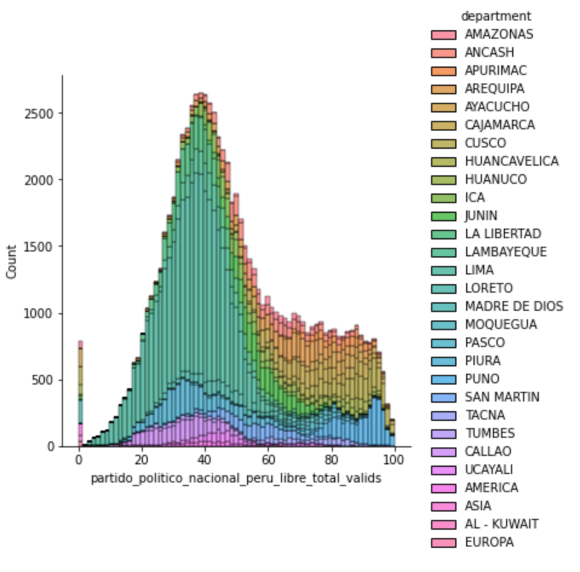

# ONPE2021 Data Extraction & Little Statistical Overview

This project saves a little scraper to save data published in [Official ONPE Page](https://www.resultadossep.eleccionesgenerales2021.pe) related to Peruvian 2021 presidential elections.

## How it works

### Data Extraction

It works pretty simple, we have public access to election results for each "mesa", where a "mesa" is a chunk of about 200-250 citizens with Peruvian nationality.
To access to one "mesa" we can fetch the results from:

```
"https://api.resultadossep.eleccionesgenerales2021.pe/mesas/detalle/<MESA_NUMBER>"
```

Where `<MESA_NUMBER>` is a six digits number and refers to one "mesa" results.
Then, we only obtain all the available "mesa"s.

With the script called `main.py`, which contains an algorithm to fetch data in a concurrent way, we can extract in partitioned CSV format files.
To run, first, you need to install [pdm](https://pdm.fming.dev) and run the following:

```bash
pdm install
pdm run python main.py
```

### Analysis

You can use the extracted data, it is saved in `dataset/dataset_*.csv`. Each csv 20000 rows, where each row is a "mesa" result.
Each "mesa" have the next columns:

```
ubigeo
place
address
department
province
district
copy_code
observation
description
candidates
total_citizens
partido_politico_nacional_peru_libre_total_valids
partido_politico_nacional_peru_libre_total_emiteds
partido_politico_nacional_peru_libre_code
partido_politico_nacional_peru_libre_congresal
partido_politico_nacional_peru_libre_list_code
fuerza_popular_total_valids
fuerza_popular_total_emiteds
fuerza_popular_code
fuerza_popular_congresal
fuerza_popular_list_code
total_votos_validos_total_valids
total_votos_validos_total_emiteds
total_votos_validos_code
total_votos_validos_congresal
votos_en_blanco_total_valids
votos_en_blanco_total_emiteds
votos_en_blanco_code
votos_en_blanco_congresal
votos_nulos_total_valids
votos_nulos_total_emiteds
votos_nulos_code
votos_nulos_congresal
votos_impugnados_total_valids
votos_impugnados_total_emiteds
votos_impugnados_code
votos_impugnados_congresal
total_votos_emitidos_total_valids
total_votos_emitidos_total_emiteds
total_votos_emitidos_code
total_votos_emitidos_congresa
```

I know, we need to document each column, but it will keep as a To-do. BTW, I think some columns have an intuitive name. Please, If you want/can help us with the naming and description, only create an Issue.

In the `analytics.ipynb` notebook you can an example of manipulation of the partitioned data.

### Example of use


